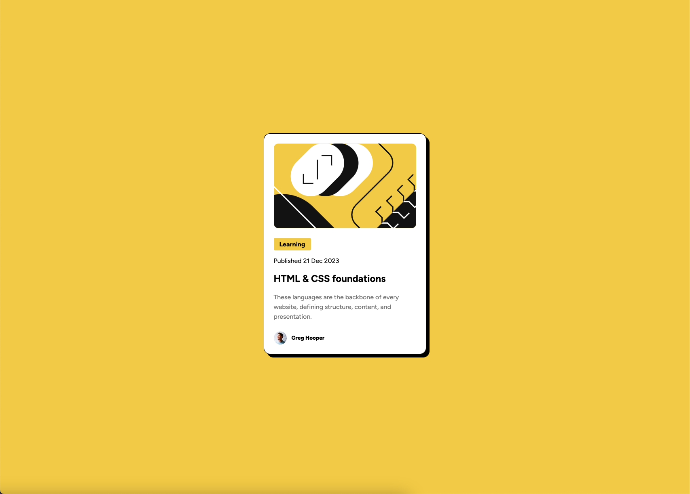

# Frontend Mentor - Blog preview card solution

This is a solution to the [Blog preview card challenge on Frontend Mentor](https://www.frontendmentor.io/challenges/blog-preview-card-ckPaj01IcS). Frontend Mentor challenges help you improve your coding skills by building realistic projects.

## Table of contents

- [Overview](#overview)
  - [The challenge](#the-challenge)
  - [Screenshot](#screenshot)
  - [Links](#links)
- [My process](#my-process)
  - [Built with](#built-with)
  - [What I learned](#what-i-learned)
  - [Continued development](#continued-development)
  - [Useful resources](#useful-resources)
- [Author](#author)
- [Acknowledgments](#acknowledgments)

**Note: Delete this note and update the table of contents based on what sections you keep.**

## Overview

### The challenge

Users should be able to:

- See hover and focus states for all interactive elements on the page

### Screenshot



### Links

- Solution URL: [Add solution URL here](https://github.com/dannypoit/dannypoit.github.io)
- Live Site URL: [Add live site URL here](https://dannypoit.github.io/)

## My process

First, I created a `<div>` for the card. Because there were no other elements that needed to go inside the `<body>` tag, I decided to use Flexbox on the `<body>` tag as the method to center the card `<div>` on the page.

Next, I added `<div>`s inside of that for the different elements for targetting in CSS, such as category, date, author, etc., and placed the existing data inside the corresponding `<div>`s.

After that, I began styling the body, card, and elements inside of it, using internal CSS, as this had already been started in the supplied HTML and allowed me to get started styling quickly without messing with the folder structure.

I also loaded the 'Figtree' font that was included.

Next, I continued to tweak the styles until the design closely matched the supplied images on desktop.

Once I thought I was finished, I moved the CSS from the HTML to a separate location inside the assets folder and loaded this in the HTML with a `<link>` tag, just for organization purposes.

After reading the README, I went back and changed some of the HTML elements to be more semantic and added `:focus` and `:hover` states to certain elements I would believe to be interactive.

### Built with

- Semantic HTML5 markup
- CSS
- Flexbox

### What I learned

- About GitHub Pages!
- About the `<time>` tag and `datetime` attribute.
- How to create a solid shadow with `box-shadow`. (I've only ever done blurry ones.)
- I need to read up more on the `@font-face` rule.
- That `<header>` and `<footer>` semantic tags can be used within sections, not just for the whole page.

This is how I used the `<time>` tag, and then I was able to target only that with CSS when creating `:focus` and `:hover` states. I did this because the app might allow users to click on the published date to see other articles that were published on that same date.

```html
<div class="date">
  Published <time datetime="2023-12-21 12:00">21 Dec 2023</time>
</div>
```

Also, I was able to group these CSS properties together when creating `:focus` and `:hover` states.

```css
h1:focus,
h1:hover,
time:focus,
time:hover,
.author-name:focus,
.author-name:hover {
  color: #5f5f5f;
  cursor: pointer;
}
```

#### Update

Some more things I learned in the comments thanks to [@rayaatta](https://www.frontendmentor.io/profile/rayaatta) and [@Islandstone89](https://www.frontendmentor.io/profile/Islandstone89):

- `<main>`, `<footer>`, and `<header>` are all landmark tags therefore none should be inside the other.
- Every web page should have a `<main>` that wraps all content except for `<header>` and `<footer>`, as this helps screen readers identify the main section of the page.
- `<div>`s are used for sectioning and don't have any semantic value, therefore you should not put text directly into them, as that doesn't help screen readers recognize the importance of such text.
- `height: 100vh` should not be set on the body, as it causes overflow issues on mobile.
- All images must have an `alt` attribute, but it can be left empty if the image is decorative.
- [CSS Reset](https://piccalil.li/blog/a-more-modern-css-reset/)

### Continued development

I would like to get more comfortable with Semantic HTML. I would like to try CSS nesting within a project and see how easy it makes it compared to Sass/SCSS. Depending on my conclusions there, I might like to learn how to quickly set up Sass/SCSS on a project. (All the projects I've used it already had it set up through Gulp, Grunt, etc.)

### Useful resources

These helped me as a reference for Semantic HTML:

- [Semantic HTML: What It Is and How to Use It Correctly](https://www.semrush.com/blog/semantic-html5-guide/)
- [HTML Semantic Elements](https://www.w3schools.com/html/html5_semantic_elements.asp)

This helped me as a reference for the `<time>` tag:

- [HTML \<time> Tag](https://www.w3schools.com/tags/tag_time.asp)

## Author

- Website - [Danny Poit](https://github.com/dannypoit)
- Frontend Mentor - [@dannypoit](https://www.frontendmentor.io/profile/dannypoit)
- X - [@dannypoit](https://twitter.com/DannyPoit)
