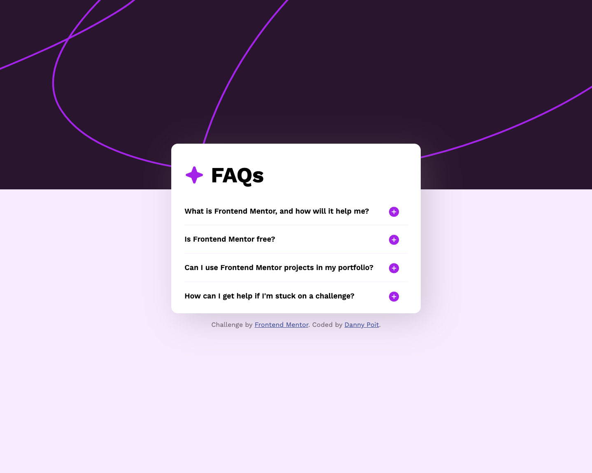

# Frontend Mentor - FAQ accordion solution

This is a solution to the [FAQ accordion challenge on Frontend Mentor](https://www.frontendmentor.io/challenges/faq-accordion-wyfFdeBwBz). Frontend Mentor challenges help you improve your coding skills by building realistic projects.

## Table of contents

- [Overview](#overview)
  - [The challenge](#the-challenge)
  - [Screenshot](#screenshot)
  - [Links](#links)
- [My process](#my-process)
  - [Built with](#built-with)
  - [What I learned](#what-i-learned)
  - [Continued development](#continued-development)
  - [Useful resources](#useful-resources)
- [Author](#author)
- [Acknowledgments](#acknowledgments)

## Overview

### The challenge

Users should be able to:

- Hide/Show the answer to a question when the question is clicked
- Navigate the questions and hide/show answers using keyboard navigation alone
- View the optimal layout for the interface depending on their device's screen size
- See hover and focus states for all interactive elements on the page

### Screenshot



### Links

- Solution URL: [https://www.frontendmentor.io/solutions/faq-accordion-fR1BRPT4EH](https://www.frontendmentor.io/solutions/faq-accordion-fR1BRPT4EH)
- Live Site URL: [https://dannypoit.github.io/faq-accordion/](https://dannypoit.github.io/faq-accordion/)

## My process

### Built with

- Semantic HTML5 markup
- CSS custom properties
- Flexbox

### What I learned

- That `<button>`s can be tabbed through by keyboard without using `tabindex`.
- How to use CSS variables.
- How to animate the expanding of sections (by animating `max-height`).
- Headings (`<h2>` etc.) are not allowed as a child of `<button>` elements.

Each FAQ is created as a section. According to [this article](https://www.semrush.com/blog/semantic-html5-guide/), "Using `<section>` is a way of grouping nearby content of a similar theme."

```html
<section class="faq">
    <button class="question">
        <h2>What is Frontend Mentor, and how will it help me?</h2>
    </button>

    <p class="answer">
        Frontend Mentor offers realistic coding challenges to help developers
        improve their frontend coding skills with projects in HTML, CSS, and
        JavaScript. It's suitable for all levels and ideal for portfolio building.
    </p>
</section>
```

I used CSS variables this time, which I had seen in another person's project:

```css
html {
    --dark-purple: #3e52a3;
    --gray: #817782;
    --light-gray: #f9eeff;
    --light-purple: #ad28eb;
}
```

For the background image, I added both into the HTML and displayed either depending on screen size. I'm open to hearing other ways of doing this.

```css
#bgMobile {
    display: block;
    max-width: none;
    width: 100%;
}

#bgDesktop {
    display: none;
}

@media (min-width: 48rem) {
    #bgMobile {
        display: none;
    }

    #bgDesktop {
        display: block;
    }
}
```

This only needed a little bit of JavaScript, and it seemed pretty straightforward.

I did not originally intend to use the `open` class on both the question and answer, but when it came time to implement the plus/minus icon, I had already written this for toggling `open` class to expand the answer, so I decided to use the same event to toggle the plus/minus.

If there's any way this could be improved, please let me know.

```js
const questions = document.querySelectorAll('.question');
questions.forEach((question) => {
    question.addEventListener('click', () => {
        const answer = question.nextElementSibling;
        answer.classList.toggle('open');
        question.classList.toggle('open');
    })
})
```

### Continued development

- Using `<button>`s was an easy solution for this project that I didn't have to think much about, but I would like to learn more about `tabindex` and how to offer better accessibility regarding keyboard.
- I would like to get better at using advanced features in CSS like variables and nesting. I am used to using Sass/SCSS for that stuff, but I would like to know what CSS's limitations are with those.
- I would like to continue to get better with ES6.
- I would like to get better with CSS animation.

### Useful resources

- [Making a clickable \<div> accessible through tab structure?](https://stackoverflow.com/questions/32659099/making-a-clickable-div-accessible-through-tab-structure) - This helped me make the FAQs selectable by keyboard.
- [How can I transition height: 0; to height: auto; using CSS?](https://stackoverflow.com/questions/3508605/how-can-i-transition-height-0-to-height-auto-using-css) - This helped me make the expanding of the answers animated.

## Author

- Website - [Danny Poit](https://github.com/dannypoit)
- Frontend Mentor - [@dannypoit](https://www.frontendmentor.io/profile/dannypoit)
- X - [@dannypoit](https://twitter.com/DannyPoit)

## Acknowledgments

I took inspiration from [@rayaatta](https://www.frontendmentor.io/profile/rayaatta) to set the card width to a percentages at certain breakpoints, and I took inspiration from [@Islandstone89](https://www.frontendmentor.io/profile/Islandstone89) to use CSS variables.
